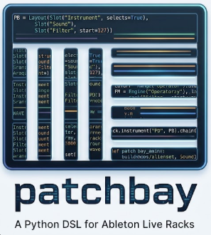

# PatchBay

<p align="center">
  
</p>

## What this is

Author Ableton Live racks in code instead of by clicking!

PatchBay is a Python DSL and a toolchain for writing Live racks and Live Sets (sessions) as source.
You declare what a rack is: engines, macro layout, bindings, ranges, zones, variations, nesting. And
`patchbay build` produces the `.adg` Live opens. It also runs backwards: `patchbay extract` reads a
saved rack and prints the declaration that rebuilds it.

Several examples are provided in the `examples/` folder. Inspired by
[strudel.cc](https://strudel.cc) and TidalCycles, PatchBay is for **offline authoring**, not live
coding. Nothing here makes a sound: it produces the assets you load in your DAW.

## TLDR: How do I run this

Needs Python 3.10+, [uv](https://docs.astral.sh/uv/), and an install of Live 12 (the Set writer
reads Live's own factory templates).

```
uv sync                         # creates .venv, installs patchbay editable
uv run poe build-examples       # Will build all the example racks and sessions
```

## Motivation

Maintaining Ableton Live racks by hand is tedious: you click every mapping, dial every variation,
and repeat fixes across copies.

By declaring your racks as code, you can use version control, diffs, and automated rebuilds.
Changing a parameter or updating for a new Live version becomes a single edit and a quick
`patchbay build`.

## Other use cases

> [!WARNING] **Sample Redistribution:** This repository does NOT redistribute audio samples. It is
> up to you, the developer cloning this repo, to provide your own samples. Drop your packs into
> `samples/<example>/all/` to have the script classify them.

**Sort a pile of samples.** Drop your packs into `samples/<example>/all/` (e.g.,
`samples/techno/all/`) in whatever shape they arrived in.

```
uv run poe fetch         # Will show some help
uv run poe fetch --apply # Will classify (copy) into the required folders
```

The result is a copy of each file into `samples/<example>/<RACK>/<category>/`, renamed and numbered
from the first free index. Nothing is moved or deleted, so a wrong classification can be fixed with
a re-run. See `samples/README.md` for details.

**Reverse engineering your hand-crafted racks.** Drop your `.adg` files into `donors/` and run:

```
uv run patchbay harvest donors/
```

This will index any new devices inside your racks so they can be used in the DSL. To generate the
Python DSL code that recreates an existing rack, run:

```
uv run patchbay extract path/to/your/rack.adg
```

The output is valid Python code that you can copy into your scripts. This is the fastest way to
learn the DSL or to migrate existing hand-crafted racks into your code.

## Why producing files rather than using the LOM API

Live already exposes a programming interface. The Live Object Model (LOM) drives a session that is
**open and running**: create a track, name it, set its routing, fire a clip, move a parameter.
Anything you can script against a live Set, script through the LOM.

The LOM falls short in two ways. Parts of it are undocumented, and parts of what a Set contains have
no API at all. Grouping devices into a rack, creating a macro mapping, setting a chain zone: none of
these are in the Object Model.

PatchBay covers the other half by writing the **files**. An `.adg` is a gzipped XML document, so is
an `.als`, so is an `.adv`. What the API will not build, the file format will.

## Basic Concepts

Similar to a real patchbay in a music studio, routing signals between studio equipment, this tool
routes macros to parameters, chains to zones, and racks onto tracks.

```python
PB = Layout(
    Slot("Instrument", selects=True),
    Slot("Sound"),
    Slot("Filter", start=127),
    Slot("Drive"),
    Slot("Movement"),
    Slot("Character"),
    Slot("Release", start=30),
    Slot("Volume", start=127),
)

RELEASE = Range(10, 20000, "ms")

FM = (
    Engine("Operator")
    .drives(PB.filter, "Filter/Frequency")
    .drives(PB.release, "Operator.0/Envelope/ReleaseTime", over=RELEASE)
)

SAMPLER = (
    Engine("OriginalSimpler")
    .drives(PB.filter, "Filter/Slot/Value/SimplerFilter/Freq")
    .drives(PB.release, "VolumeAndPan/Envelope/ReleaseTime", over=RELEASE)
)

PD = Rack.instrument("PD", PB).chain("FM", FM).chain("Sample", SAMPLER)
```

Both engines bind the same layout slots to their own parameters, so one knob moves the same musical
idea through different synthesis. An engine profile is a value, so it is declared once and used by
every rack that wants that engine.

Most of the vocabulary is Live's. A few terms are this project's own:

| term               | from     | what it means                                                                                           |
| ------------------ | -------- | ------------------------------------------------------------------------------------------------------- |
| **rack**           | Live     | a container of parallel chains, with 16 macro knobs on its front                                        |
| **chain**          | Live     | one signal path inside a rack, holding devices                                                          |
| **device**         | Live     | an instrument or effect: Operator, Saturator, Auto Filter                                               |
| **macro**          | Live     | one of the rack's 16 knobs. Its position is 0..127 and nothing else                                     |
| **chain selector** | Live     | the control that decides which chain is live                                                            |
| **zone**           | Live     | the span of 0..127 over which one chain answers the selector                                            |
| **pad**            | Live     | a drum rack chain, chosen by a MIDI note instead of a zone                                              |
| **variation**      | Live     | a stored position for every macro, recalled as one. Live's UI says Variations, the XML says Snapshots   |
| **mapping**        | Live     | the stored link from a macro to a parameter. What a binding compiles INTO                               |
| **engine**         | PatchBay | one chain and the device in it, treated as one way of making the sound                                  |
| **slot**           | PatchBay | one position in the layout. Slot N is macro N, and it carries its own name, opening position and label  |
| **layout**         | PatchBay | the ordered list of slots, shared by every rack that uses it                                            |
| **engine profile** | PatchBay | how one device answers a layout: a value, reusable across racks                                         |
| **role**           | PatchBay | what a rack asks its wildcard slot to do. An engine `offers` roles, a rack `spends` a slot on one       |
| **binding**        | PatchBay | one slot pointed at one parameter of one device                                                         |
| **setting**        | PatchBay | a device control with no `Manual`, so it can be set but never driven. Drift's modulation routing is one |
| **range**          | PatchBay | the span of that parameter the macro drives, in the parameter's own units                               |
| **label**          | PatchBay | what a knob is CALLED on this rack, which is not what it is keyed by                                    |
| **donor**          | PatchBay | a real device instance to copy a device from                                                            |
| **spec**           | PatchBay | a Python module declaring racks, the input to `patchbay build`                                          |

**A layout is a contract, not a template.** It says slot 3 is `Filter` and that slot 3 is macro 3,
everywhere. A rack does not _have_ those macros, it BINDS its own parameters to them. Reuse the
layout across racks and one knob means one musical idea on every one of them, structurally rather
than by discipline.

**A binding names a parameter, and parameter names are not the GUI labels.**
`Filter/Slot/Value/SimplerFilter/Freq` is Simpler's cutoff. This is why `donors/` exists and why a
binding is written against one, never from memory: see
[how this was reverse engineered](#the-amazing-adventure-of-reverse-engineering-how-ableton-saves-stuff)
for details.

**A range is what makes a slot mean the same thing twice.** Two engines can bind the same slot to
the right parameter each and still disagree, because one is decibels and the other linear amplitude,
or one is seconds and the other milliseconds. Where engines disagree about units, the range is the
only place the agreement can live. Live 12.4.3 has no UI for it at all.

**A variation is a vector over slots, in macro space.** So it renders through every engine without
being written per engine, and it can select its own engine on the way:

```python
PD1.variations(
    PB.variation("dark", instrument=PD1.engine_macro("FM"), filter=30, release=110)
)
```

**A chain may hold a rack instead of a device.** Bindings are then outer slot to inner slot,
defaulting to identity where both racks share a layout, so one knob reaches through however many
levels lie between it and the parameter:

```python
VA1 = (
    Rack.instrument("VA1", PB)
    .chain("PADS", PD1.chaining())
    .chain("KEYS", LD1.chaining(PB.filter, PB.release))
)
```

`chaining()` with no slots keeps the identity default. Naming slots drives only those, and
`PB.character.to(INNER.movement)` drives an inner slot with a different name.

## The amazing adventure of reverse engineering how Ableton saves stuff

Ableton publishes no schema, and its element names are not the GUI labels: Saturator's Drive knob is
`PreDrive`, Simpler's cutoff is `Filter/Slot/Value/SimplerFilter/Freq`.

So I've had to guess some stuff, but following a strict methodology: Change one thing in Live, save,
diff the two files, write down what moved.

The findings are in [`doc/ARCHITECTURE.md`](doc/ARCHITECTURE.md), each marked verified or inferred,
with the evidence in [`doc/SCHEMA.md`](doc/SCHEMA.md).

`donors/` contains real device instances, harvested from racks and Sets hand crafted, and they are
what the DSL is learned from: a device's parameter list, the path to each parameter, and the native
range each one spans. A binding is written against a donor and checked. `patchbay harvest` adds more
from any file you already own.

## What works today

Every item below was gated by loading the output in Live 12.4.3.

- read, write, lossless round trip
- structural diff, which is the discovery engine
- node navigation and parameter addressing, including nested paths
- macro mappings read and written, including ranges Live's own UI cannot set, and INVERTED ranges,
  where the knob rises as the parameter falls
- return chains with per-chain send levels, and one macro that sweeps every chain's send to a return
  at once
- per-track instances of a rack: one declaration, one name per track
- a whole Live Set: tracks, named returns, track colours, a send per return on every track, every
  rack placed in order, a track routed into another track, and each sidechain fed from a track you
  name. EXAMPLE_PLAYGRND is 8 tracks, 6 returns and 52 racks, written by one command and opened in
  Live 12.4.3
- ONE spec for both: the same file declares the racks and the Set that places them, and the Set is
  built from those rack objects rather than from `.adg` files on disk, so it can never describe a
  stale one
- chain and pad cloning
- the DSL and its compiler: engines, bindings, ranges, zones, labels, start positions, variations,
  nesting to any depth
- sample retargeting, so a chain plays a file you name rather than whichever one the donor happened
  to carry
- sample DISCOVERY: a rack reads `samples/<RACK>/`, one subfolder per category, and turns every file
  it finds into a chain. Adding audio to a folder adds a chain on the next build, with no list in
  the spec
- extraction, the compiler backwards, from a rack preset OR from every rack on every track of a Live
  Set
- donor harvesting from any saved file, Live Sets included
- setting device controls no mapping can reach, which is how a modulation routing gets written at
  all

- several devices in one chain, which is what a channel strip is
- MIDI effect racks

`patchbay extract` prints the declaration for a saved rack: chains, device types, bindings with
their ranges, zones, samples, macro positions, labels, variations and nesting.

```
patchbay extract build/DR1.adg > dr1.py
patchbay build dr1.py -o build/rt/
patchbay diff build/DR1.adg build/rt/DR1.adg      # identical
```

`patchbay harvest` is how the donor library grows, from files you already own:

```
patchbay harvest "path/to/Project"
```

`uv run poe test` runs 116 tests asserting the library still agrees with every recorded finding. One
of them clears the variations Live wrote in `racks/s8_c.adg`, writes them back through `patchbay`,
and requires the diff to be empty. Another holds a digest of every example rack, DR1's 178,960 facts
included, so a change that is not supposed to move the output proves it here rather than by dragging
files into Live.

## What it does not do

`patchbay` authors racks, and places them in a Set. It does not write clips, arrangement, automation
envelopes or a groove pool.

It does not choose sounds either. Which kick is good, whether one knob feels comparable across two
synthesis engines, and where the mix sits are the parts worth doing by hand, and the tool exists to
leave time for them.

This is where the valuable expertise of a music producer comes in! Your taste I cannot replace nor
automate.

## What PatchBay handles behind the scenes

Live Sets have strict, undocumented structural constraints. For example, a Set must have exactly one
send-pre flag per return, one send per return on every track, and properly sized clip slot lists per
scene. Getting these wrong produces a file that parses fine but silently crashes Live.

You don't need to worry about any of this. The DSL contract is simple: you author the `.als` the way
you want in your Python spec, and PatchBay automatically handles all these hidden constraints (documented in the project's internal schema lab notes) to ensure the generated file opens safely.

## Building and running

Managed with [uv](https://docs.astral.sh/uv/).

```
uv sync                         # creates .venv, installs patchbay editable
```

Editable matters, and `uv sync` does it by default: specs and findings are both still moving.

Then either activate the environment, or prefix commands with `uv run`:

```
uv run poe build-examples
uv run poe test
```

`uv run` works from any directory with `--project`, which matters for the probe scripts in `build/`.
Nothing needs a global install, and there is no `pip install -e .` step to get stale - the failure
mode that prompted this was an editable install still pointing at the folder's old name.

## Commands

| command                              | does                                                                                      |
| ------------------------------------ | ----------------------------------------------------------------------------------------- |
| `patchbay build SPEC -o DIR`         | compile a spec into rack presets, one `.adg` per rack and nothing else                    |
| `patchbay build SPEC --clean`        | the same, dropping `.adg` files in the output directory this build did not write          |
| `patchbay session SPEC -o OUT.als`   | write a Live Set from the same spec: tracks, returns, colours, routing, every rack placed |
| `patchbay diff A B`                  | structural diff: the discovery engine                                                     |
| `patchbay mappings SRC`              | list macro mappings                                                                       |
| `patchbay variations SRC`            | list macro variations                                                                     |
| `patchbay clone SRC DEST -n N`       | duplicate a chain                                                                         |
| `patchbay extract SRC`               | emit DSL source for a saved rack                                                          |
| `patchbay extract SRC --layout SPEC` | the same, naming slots from a spec whose bindings agree                                   |
| `patchbay harvest SRC -o DIR`        | lift donors out of files or Live Sets                                                     |
| `patchbay check SRC`                 | would Live accept this file?                                                              |
| `patchbay roundtrip SRC`             | prove load-then-save is lossless                                                          |
| `patchbay ids SRC`                   | id census and collision report                                                            |
| `patchbay unpack` / `repack`         | gzip in and out, for eyeballing XML                                                       |

`patchbay <command> --help` for options. Two worth knowing: `diff -n N` caps output per section,
because adding one device drags its whole parameter blob in (a Reverb is some 800 facts). And
`clone --stride N` gives each copy its own macro block rather than ganging them together.

## Layout

```
patchbay/    the library. Knows XML, ids, macros, chains, FileRefs.
             Knows nothing about kick drums. Keep it that way.
examples/    specs. playgrnd.py is the big one, and the end-to-end test.
doc/         how the format works, and how we found out.
donors/      real device instances harvested from Live, to copy from.
racks/       spike evidence. Every verified claim traces to one of these.
samples/     audio.
build/       generated output, gitignored.
tests/       assertions against the recorded findings.
```

## Documentation

| file                      | what it is                                                 | read it when                           |
| ------------------------- | ---------------------------------------------------------- | -------------------------------------- |
| **`doc/TODO.md`**         | the live backlog: in flight, next, open spikes             | before starting anything               |
| **`doc/ARCHITECTURE.md`** | how the `.adg` format works (the consolidated model)       | before writing code that touches XML   |
| **`doc/DSL.md`**          | why the DSL is shaped as it is                             | before extending the DSL               |
| **`doc/RESEARCH_CATALOGUE.md`**       | discovery procedure and the spikes that answered it        | before investigating anything          |
| **`doc/SCHEMA.md`**       | lab notebook: raw findings, citing files                   | when you doubt a claim in ARCHITECTURE |
| **`doc/EXAMPLE_*.md`**    | particular examples (the musical ideas) to build this tool |
| `doc/THE_BASEMENT.md`     | ideas that failed, and what killed them                    | before reviving a good-sounding plan   |
| `CLAUDE.md`               | working method and landmines                               | first, if you are an agent             |

`doc/ARCHITECTURE.md` is the model, `doc/SCHEMA.md` is the evidence. If they disagree, SCHEMA wins,
because it cites files.

`doc/TODO.md` is the only file that says what is unfinished. When a task lands it leaves that file,
into README, ARCHITECTURE or THE_BASEMENT.

## Live version

The file format is version specific. Everything here was established against Live **12.4.3**, and a
major Live update may need the findings rechecked. How that checking is done is `CLAUDE.md` and
`doc/RESEARCH_CATALOGUE.md`, which are written for whoever, or whatever, does the work.

## TODO

Please check the detailed backlog of what remains to be done on [`doc/TODO.md`](doc/TODO.md).
